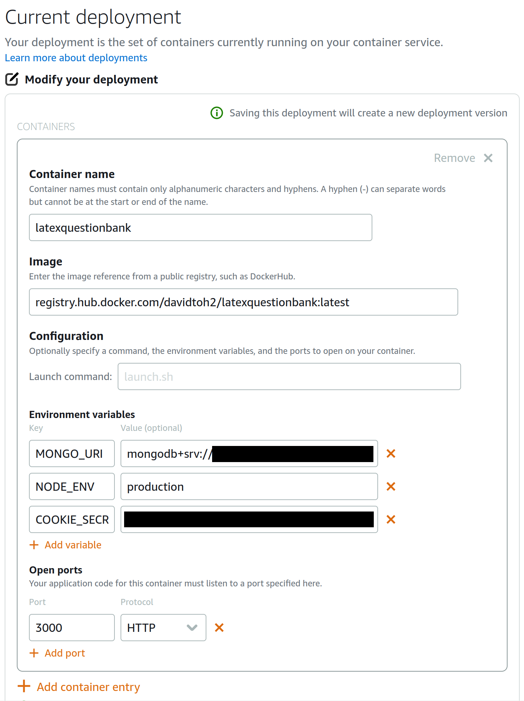
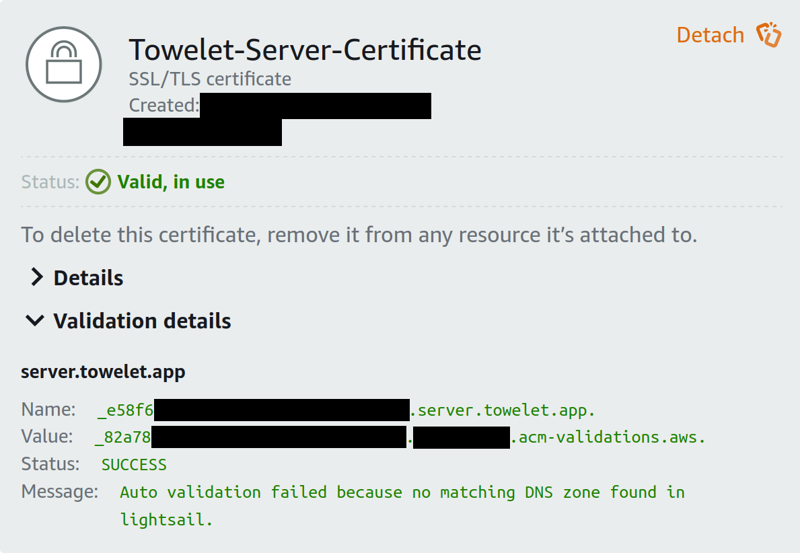
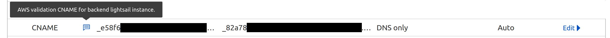

# Introduction

This document describes the steps taken to deploy both the server and the database onto their respective cloud services.

- [Introduction](#introduction)
- [Server: Publishing Docker Image](#server-publishing-docker-image)
- [Server: Deploying to AWS Lightsail](#server-deploying-to-aws-lightsail)
  - [Deploying to Lightsail using Deployment Interface](#deploying-to-lightsail-using-deployment-interface)
  - [Deploying to Lightsail using AWS CLI Lightsail Plugin](#deploying-to-lightsail-using-aws-cli-lightsail-plugin)
  - [Deployment Health Check](#deployment-health-check)
- [Environment Variables](#environment-variables)
- [Enabling Custom Domain](#enabling-custom-domain)
- [Database: MongoDB Atlas](#database-mongodb-atlas)
  - [Network Access (TBD)](#network-access-tbd)

# Server: Publishing Docker Image

When our Docker image is ready to publish to **Docker Hub**, perform the following steps:

1. Remove old versions of our image with `docker image rm`, or prune dangling images (i.e. versions with no tag).
2. Tag our image with `docker tag latexquestionbank [username]/latexquestionbank:latest`. 
3. Push using `docker push [username]/latexquestionbank:latest` to Docker Hub.
4. Optionally we may also replace `latest` with a version number, to version the current instance of the image as a backup.

# Server: Deploying to AWS Lightsail

We set up an AWS Lightsail container service called **latexbuilder**. This service will host our container, **latexquestionbank**.

## Deploying to Lightsail using Deployment Interface

We can use the Lightsail Deployment Interface to directly *pull images from Docker Hub* into AWS Lightsail. We are required to enter the full image name: `registry.hub.docker.com/<user>/<image>:<tag>`. Ensure that the image is public before pulling.



Once the deployment is live, we can connect to the Lightsail container via a public HTTPS URL:
```
https://latexbuilder.<rng>.ap-<region>.cs.amazonlightsail.com/
```

[Container Deployment Tutorial](https://aws.amazon.com/tutorials/deploy-webapp-lightsail/module-three/)

## Deploying to Lightsail using AWS CLI Lightsail Plugin

An alternative method is to [install](https://lightsail.aws.amazon.com/ls/docs/en_us/articles/amazon-lightsail-install-software) and use the AWS CLI Lightsail plugin. To do so, we would need to setup an IAM profile for Lightsail.

We create an IAM policy, **Lightsail-latex-builder-full-access**, with full access to our Lightsail resources.

We then create an IAM user, **lightsail-latex-builder-access**, and assign it to the above permission policy.

We also generate an access key pair for this user, and add the user to the AWS CLI using `aws configure --profile lightsail-latex-builder-access`.

Once done, we may run the following command to push a *local container image* to AWS Lightsail:
```sh
aws lightsail push-container-image           \
    --profile lightsail-latex-builder-access \
    --region ap-southeast-1                  \
    --service-name latexbuilder              \
    --label latest                           \
    --image latexquestionbank:latest
```
Sadly this isn't working as `aws lightsail` cannot detect the Docker daemon.

[IAM Policy Tutorial](https://lightsail.aws.amazon.com/ls/docs/en_us/articles/amazon-lightsail-managing-access-for-an-iam-user)

[Access Key Tutorial](https://lightsail.aws.amazon.com/ls/docs/en_us/articles/lightsail-how-to-set-up-access-keys-to-use-sdk-api-cli)

## Deployment Health Check

Lightsail will regularly ping the image, running internally, to ensure that the deployment is still live. We increase the health check interval in the Lightsail Deployment interface to 300s, to avoid spamming the logs.

We add a simple route at the tail end of our server's route middleware stack:
```
// Application error handler above

app.use('/', function(req, res, next) {
    res.send("Health check successful!")
})

// Routing error handler below
```
When we access the server via the aforementioned public HTTPS URL, we should get a response (code 200) that simply says "Health check successful!"

# Environment Variables

Because our Docker image has to be public for the deployment interface to work, we cannot store environment variables, including application secrets, directly in the image. As such, we need to evaluate the different approaches to handling environment variables in a production environment.

1. Insecure method: dotenv + Adding `.env` file into Docker container

**dotenv** is an npm package that lets a NodeJS application read environment variables. We can use it to read a local `.env` file as follows:
```js
const envpath = path.join(__dirname, '.env')
require('dotenv').config({ path: envpath })
```
The environment file path is the application's root file (i.e. pwd) by default.

Note that this requires the `.env` file to be copied into the Docker image.

[Using dotenv](https://stackoverflow.com/questions/42335016/dotenv-file-is-not-loading-environment-variables)

2. dotenv-vault

**dotenv-vault** is a privately-managed, cloud version of dotenv that implements encryption. Environment files are encrypted and stored in the dotenv-vault team's own Git repo, and can be pulled or pushed to by different members in a team.

However, dotenv-vault is generally only recommended for use in development and staging environments, not for production settings, due to the inherent risk of data leakage in any cloud platforms.

[Drawbacks of using dotenv-vault](https://stackoverflow.com/questions/52546426/is-module-dotenv-for-development-only)

3. Manually keying variables in the Lightsail Deployment interface. **We use this method.**

The following variables are required for our production environment:
```
MONGO_URI
COOKIE_SECRET
NODE_ENV (seems to be automatically set)
```
There are a whole bunch of other variables that are necessary, but they are also detailed in the other documents so I won't list them all here.

The environment variables are remembered across deployments, so hopefully you only need to do this once!

# Enabling Custom Domain

For Cloudflare to communicate with Lightsail over HTTPS, we need to create and install an SSL certificate on our Lightsail instance.

We generate an SSL certificate in the AWS Lightsail dashboard, specifying our backend's subdomain as the origin domain.



This generates a `key:value` pair in the form
```
key: _RNG.domain
value: _RNG2.RNG3.acm-validations.aws
```
which we will have to add as `name:target` to Cloudflare's domain lookup table, in order to verify that we own the domain we specified. (Remove the dots at the end of both strings.)



Once verification is complete, we will be able to access our Lightsail deployment using our domain.

# Database: MongoDB Atlas

We set up a cloud-hosted **MongoDB Atlas** database `questiondb`, and configure a root username and password. All connections to the database subsequently require authentication via the connection URI
```
mongodb+srv://<username>:<password>@questiondb.<srvID>.mongodb.net/?retryWrites=true&w=majority
```

## Network Access (TBD)