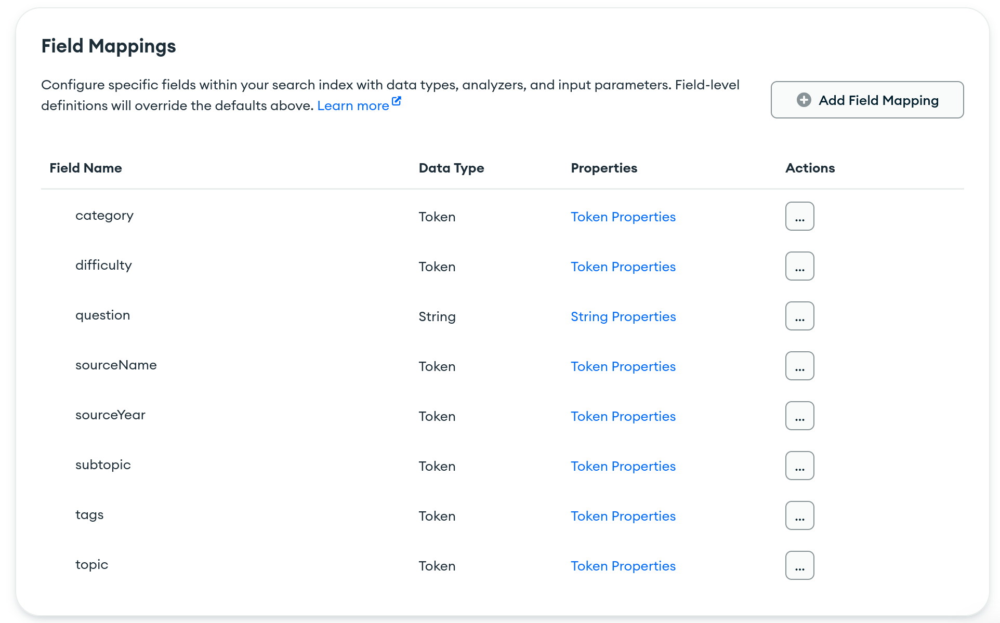
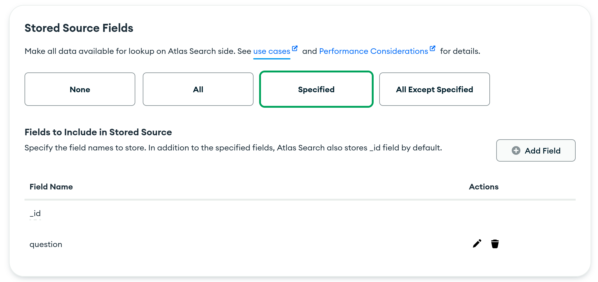

# Introduction

This file serves to document our database implementation, as well as how it interacts with the server.

- [Introduction](#introduction)
	- [What is Mongo?](#what-is-mongo)
- [Connecting (TBA)](#connecting-tba)
- [Collections and Schemas](#collections-and-schemas)
- [Building Queries](#building-queries)
	- [Query Operators](#query-operators)
	- [Text Search using $text (Local Databases)](#text-search-using-text-local-databases)
	- [Skip and Limit](#skip-and-limit)
	- [Aggregation Pipeline](#aggregation-pipeline)
- [Document updates](#document-updates)
	- [Atomic Updates](#atomic-updates)
- [Mongo Atlas Search](#mongo-atlas-search)
	- [$search Operators](#search-operators)
	- [Compound Queries](#compound-queries)
	- [Search Index](#search-index)
	- [Stored Source Fields](#stored-source-fields)

## What is Mongo?

**MongoDB** is a NoSQL database framework that uses **document schemas**. Its main daemon and shell are called `mongod` and `mongosh` respectively. I'm not sure how to use these, and I don't think we need to know anyways.

**Mongoose** is a NodeJS API for connecting to, and interacting with, Mongo databases. It is designed to closely mimic the syntax of `mongod`.

**MongoDB Atlas** is MongoDB's cloud-hosted database service. We use its free tier for our production database.

For more details on how the development database is set up, please refer to the [Development Configuration](../development/setup-and-configuration.md) document.

The native Mongo Shell is known as `mongosh` and is the default way for interacting with Mongo databases. Documentation can be found [here](https://www.mongodb.com/docs/mongodb-shell/run-commands/). It provides us with a shell-like interface where we can issue commands to a database, as such:

```sh
use myDatabase      					# switches database

db										# display the current database
db.collectionName.find({...})			# find document matching query {...}
db.collectionName.insertOne({...})		# insert document with data {...}
```

Mongoose provides us with convenient Javascript wrappers for MongoDB operations that somewhat simplifies syntax and provides higher-level data modelling capabilities, as compared to the native NodeJS MongoDB driver. Documentation can be found [here](https://mongoosejs.com/docs/6.x/docs/guide.html).

# Connecting (TBA)

We connect to a Mongo database using a Mongo URI. All URIs are of the form
```
MONGO_URI=mongodb+srv://user:password@DB_NAME.ID.mongodb.net
MONGO_DEV_URI=mongodb://user:password@DB_NAME:PORT/?authSource=admin
```
Mongoose provides us with a convenient API with which to make our connection:

```js
mongoose.connect(mongo_uri).on('error', callback)
```

For our Mongo Atlas deployment we additionally need to restrict network access to a list of allowed IP addresses. Since we only expect our server to talk to the deployed database, so we 

# Collections and Schemas

- A **schema** is a template for a type of object.
- A **document** is a single instance of an object. Every document has *fields* which may be filled in with data, known as *values*.
- A **collection** is a group of documents related by a common schema.
- A **database** is a group of collections.

Collections are thus akin to tables in SQL-like databases.

Schema files are stored under `db/models`. A schema may be declared using the syntax
```js
const Schema = mongoose.Schema
const DocumentSchema = new Schema( {
    documentID: {type: String, required: true}, ...
})
module.exports = {DocumentSchema}
```

The schema is imported into the relevant database codefile. We then link the relevant collection to the schema, and use it to build a **model**, which is basically a fancy object constructor compiled from the schema.

```js
const documentDB = mongoose.connection.useDb('documents', { useCache: true })
const Documents = templateDB.model('documents', DocumentSchema)
```

All collection functions are called as methods of the model variable, and *must be awaited*:

```js
const res = await Documents.findOneAndUpdate(dataDict)
```

The following table describes the respective functions handled by each of the five database codefiles:

| File               | Database    | Function                                                                                                           |
|--------------------|-------------|--------------------------------------------------------------------------------------------------------------------|
| `db-connection.js` |             | Main Mongoose connection                                                                                           |
| `db-question.js`   | `questions` | <li>Get, set and delete questions</li><li>Get and set question permissions</li>                                    |
| `db-auth.js`       | `users`     | <li>Login, logout and signup</li><li>Get user info from userID, and vice versa</li><li>Modify user info</li> |
| `db-file.js`       | `templates` | Get and set templates |
| `db-token.js` | `tokens` | <li>Handles token operations</li> <li>Sensitive user operations e.g. password change</li>

# Building Queries

The easiest way to build a query is to pass a dictionary as the **query parameter** into `find()`. An equality comparison will be performed across all documents in the database. mongosh and Mongoose provides variants of the find method, such as `findOne()` which only returns one document.

```js
const tok = await Tokens.findOne({token: t})
```

If we only want specific fields of the documents to be returned, we can issue a second **projection parameter** into our query function. Documentation can be found [here](https://mongoosejs.com/docs/6.x/docs/api/query.html#query_Query-select). The projection parameter can take the form of either a space-delimited string of field names, or an array of strings.

```js
const q = await Question.findOne(qID, 'userPerms')
```

## Query Operators

Sometimes we don't want to just do equality comparison - we want to perform more advanced data filtering. In this case, we may use Mongo's inbuilt query operators. Documentation can be found [here](https://www.mongodb.com/docs/manual/reference/operator/query/).

All operators start with a $ sign. (Thanks to Javascript, it's not necessary to put quotes around them, although we do so for clarity.) The general syntax of most operator-embellished queries is as follows:

```js
query = {
	"field1": { "$op1": value },
	"field2": { "$op2": value }
}
```

This query implicitly uses the `$and` operator, which is arguably easier for us to build queries with as it uses array notation:
```js
query = {
	"$and": [{ "field1": { "$op1": value } }]
}
query["$and"].push({ "field2": { "$op2": value } })
```
(Note that `$and` MUST take as its value a non-empty array of queries.)

Other common query operators we use are:
- `$all`: matches iff the field's value is an array that contains ALL the elements in the specified array
- `$in`: matches iff the field's value is in the specified array, or the field is an array all of whose values are in the specified array
```js
// "must contain all the elements in"
{ "topic": { "$all": dataDict.topic } }
// "all elements must be in"
{ "topic": { "$in": VALID_TOPICS } }
// Note: according to the $and documentation, multiple operators on the same field can be joined into the same dictionary in an implicit $and operation.
```

## Text Search using $text (Local Databases)

Text querying on self-managed deployments relies on the `$text` query operator. Documentation can be found [here](https://www.mongodb.com/docs/manual/reference/operator/query/text/#mongodb-query-op.-text) and provides many additional configuration options to this operator. The general syntax is as such:
```js
{ "$text": { "$search": qnText } }
```

A **text index** must be created for each of all fields being searched.

Behaviour:
- All text-indexed fields will be searched - i.e. it is impossible to select a subset of fields to search.
- The search text will be treated as a space-delimited list of words, and a logical OR will be performed on the list of words.
- This must appear as the first stage of any query pipeline.

The text index may be created as follows:
```js
questionSchema.index({ question: "text" })
```

## Skip and Limit

We may implement effective pagination using the `skip()` and `limit()` Mongoose methods. For page $n$ we skip $10(n-1)$ documents and limit to $10$ documents.

Note that for purposes of pagination this is not very performant as Mongo will still need to check a total of $skip + limit$ documents; see [this link](https://stackoverflow.com/questions/7228169/slow-pagination-over-tons-of-records-in-mongodb) for details. The recommended way is to use `searchBefore` and `searchAfter` as described in [this tutorial](https://www.mongodb.com/docs/atlas/atlas-search/tutorial/divide-results-tutorial/#jump-from-page-2-to-page-5-using-searchafter-and--skip) (TBD).

## Aggregation Pipeline

The aggregation pipeline is an inbuilt feature in MongoDB that allows us to execute queries and operations as sequential pipeline stages. We use this in `db-question/getQuestions()`.

A typical pipeline consists of the following stages, all of which have Mongoose wrapper functions:

```js
const res = await Question.find({			// Query
		"$text": {"$search": q.question},
		"topic": {"$all": q.topic, "$in": VALID_TOPICS},
		...
	})
	.sort({"score": {"$meta": "textScore"}})	// Sort by text search score in descending order
	.skip(skipCount).limit(limitCount)			// Skip and limit results
	.lean()										// Convert to plain JSON object
```

Note that Mongoose also has a more low-level `aggregate()` method which lets us pass in a raw aggregation pipeline. This takes the form of an array of objects, each representing a distinct stage in the pipeline. Refer to the production database documentation below for more details on how it is implemented.

# Document updates

Mongoose provides a variety of different ways to perform document updates. A summary can be found [here](https://masteringjs.io/tutorials/mongoose/update).

| Function                   | Features                                                                                                                           | Use cases                      |
|----------------------------|------------------------------------------------------------------------------------------------------------------------------------|-------------------------------|
| `findOne()`, then `save()` | <li>Non-atomic</li> <li>Explicitly check for presence of document</li> <li>Check other document fields before updating</li> <li>Load document into program memory</li> <li>Automatic validation</li>| Useful for explicitly throwing errors on missing documents <br> Allows more complex manipulation and checking of individual fields <br> `modifyUser`, `_modifyAccountStatus` |
| `findOneAndUpdate()`       | <li>Atomic</li> <li>Returns `(err, document) = (null, null)` if document missing</li> <li>Returns updated document with `{new: true}`</li> <li>Run validators with `{runValidators: true}`</li>| Useful for mitigating potential concurrency issues <br> Ensures _isolation_ of operations (i.e. no partial execution nor mutual interference) <br> `setQuestionPerms`, `saveQuestion`, `changePassword` |
| `find().lean()` | <li>Almost identical to `findOne()`</li> <li>`lean()` returns plain JSON object rather than document</li> | Useful for data read operations involving no writes <br> `findUsernameUsingID`, `findUserInfoUsingID`, `getQuestions` |

Code examples follow:

```js
const u = await Users.findOne({ username: name })
u.socialData.bio = newBio
await u.save()

const qs = await Question.findOneAndUpdate(qID, dataDict, {new: true})

const userArr = await Users.find(u, 'id').lean()
```

## Atomic Updates

In most instances we do not need to make use of the more advanced update operators available. Their primary application in our implementation is to allow for atomic updates to arrays using `$pull` and `$push` respectively:

```js
var q = await Question.findOne(qID)
var r = await q.updateOne({ $push: { 'userPerms.canReadGroups': targetName }})
return r
```

Documentation can be found [here](https://www.mongodb.com/docs/manual/reference/operator/update/).

# Mongo Atlas Search

Mongo Atlas provides its own search capability via a feature known as **Atlas Search**. *This feature is separate from the default MongoDB query and update operators*, and comes with the ability to perform not just text searches but also perform more "traditional" filtering such as equality comparisons and array-based checks, as well as advanced semantic features which we do not use.

Atlas Search is implemented as the pipeline stage `$search`, which must be the first stage of the aggregation pipeline. Mongoose has a corresponding `search()` method. Note that it is thus *implicitly mandatory to use an aggregation pipeline to implement Atlas Search*.

The `$search` pipeline takes a search clause, or a series of clauses. The general syntax looks like this:
```js
qnsAll = await Question.aggregate()
	.search("text": {"query": qnText, "path": "question"})
	.skip(skipCount).limit(limitCount)
// or use the lower-level implementation:
qnsAll = await Question.aggregate([
	{"$search": {"text": {"query": qnText, "path": "question"}}},
	{"$skip": skipCount},
	{"$limit": limitCount}
])
```

Documentation can be found [here](https://www.mongodb.com/docs/manual/reference/operator/aggregation/search/). Mongoose documentation can be found [here](https://mongoosejs.com/docs/6.x/docs/api/aggregate.html#aggregate_Aggregate-search).

## $search Operators

Here are some common search operators we use:

- `text`: perform a textual search on the field. Takes two parameters `path` (name of the field) and `query` (search string)
- `in`: match the value of the document's field to any value in the given array. Takes two parameters `path` (name of the field) and `value` (given array of desired values).
  - According to the documentation, *if the document's field contains an array of values*, this operator matches if and only if *at least* one value in the given array is present.
  - As far as I was able to tell, there is no `$all` equivalent in Mongo Atlas.
- `queryString`: match the value of the document's field to a query string that can use boolean and range predicates (but unfortunately not process arrays).

## Compound Queries

The `compound` operator combines two or more operators into a single query. The operator takes up to four arrays of clauses with the following behaviours:
- `must` and `mustNot`: self-explanatory
- `should`: clauses that you prefer to match; gives documents a higher score
- `filter`: same as `must` but does not affect the document's score

The general syntax of a compound query follows:
```json
"$search": {
	"index": "question-search",		// explained below
	"compound": {
		"must": [
			{"queryString": {"path": "category", "value": "Mathematics OR Computer Science"}},
			{"in": {"path": "topic", "value": qn.topic}}
		],
		"should": [
			{"text": {"query": qnText, "path": "question" }}
		]
	}
}
```

## Search Index

Atlas Search is an embedded full-text search and hence depends on a **search index** to perform text embedding prior to any search operation. This search index may be created in the visual editor on the Atlas console. We give it the name **question-search**.

We need to choose an *analyzer* for our index. The analyzer is responsible for converting text into smaller, searchable *tokens*. We stick with the standard analyzer.

We now configure the index's **field mappings**. For every field we want to search on, we need to index it according to a specified data type:



- The `token` data type stores the entire value of the field as a single token. This is ideal for equality comparisons (for values of any types).
- The `string` data type converts fields whose values are strings into a list of tokens to be stored. This is ideal for textual search.

Since we only ever want to perform a search on the question text, and want equality comparisons on all other fields, we configure the field mappings as shown above.

## Stored Source Fields

We may additionally configure **stored source fields**. This allows us to store specific fields separately for retrieval.

By default, after the first stage in any pipeline has returned a set of documents, MongoDB performs full document lookup on the database implicitly (i.e. works with the entire document, for all these returned documents), for all subsequent stages of the pipeline. 
- If each document is large, then working with entire documents at every stage can become inefficient;
- If the returned dataset contains a lot of documents, keeping unnecessary fields around can also lead to inefficiency.

Stored soruce fields are a way to keep only the minimum number of fields required for subsequent stages (such as sorting, matching, grouping and skipping). If any aditional fields need to be returned at the very end, an additional `$lookup` stage can be appended to fetch these fields.

Documentation can be found [here](https://www.mongodb.com/docs/atlas/atlas-search/performance/index-performance/#storing-source-fields).



Note that, for the purposes of our database, the only real use of these stored source fields is to speed up the `skip()` and `limit()` stages (for which we only really need the `_id` field). This is a potential future improvement and is **currently not implemented in our database**.