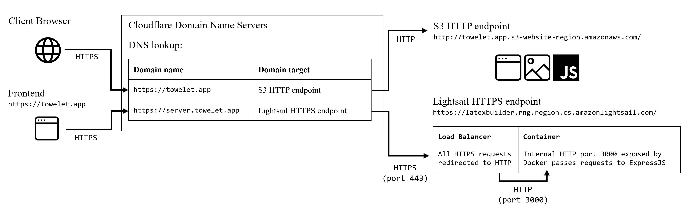

# Introduction

This document serves to be a primer on DNS, Routing and Web protocol concepts, as well as detail the steps taken to configure the app's web communications correctly in a production environment.

- [Introduction](#introduction)
- [A primer to networking](#a-primer-to-networking)
  - [Domains](#domains)
  - [Domain Name Servers (DNS)](#domain-name-servers-dns)
  - [Network Protocols](#network-protocols)
  - [HTTPS and SSL/TLS](#https-and-ssltls)

# A primer to networking

## Domains

A **domain** refers to a name given to a website, or web resource, that allows end users and other applications to access it using a *Uniform Resource Locator (URL)*.

These resources are usually hosted on servers that are connected to the Internet using specific IP addresses. Domains are essentially "mapped" to IP addresses, allowing end users to communicate with these IP addresses more easily.

## Domain Name Servers (DNS)

DNS, or **Domain Name Servers**, are servers containing tables that map **Fully Qualified Domain Names (FQDNs)** to their corresponding targets. These are known as **lookup tables**. 

Whenever a DNS receives a network request to a specific domain, the server will perform a **DNS lookup** to search for the corresponding domain target, then re-route this request to the correct target.

Targets may come in a few forms:
- **A records** and **AAAA records** point to IPv4 and IPv6 addresses respectively;
- **CNAME records**, or alias records, point to other FQDNs;
- **MX entries** direct email to a mail server, and dictate how emails shoud be handled using the Simple Mail Transfer Protocol (SMTP).

## Network Protocols

The **HyperText Transfer Protocol (HTTP)** is a network protocol that has been widely in use since antiquity, and is a method of information transfer. However, information transferred using this protocol is not encrypted

**HyperText Transfer Protocol Secure (HTTPS)** is a more recent *scheme* of the HTTP protocol, that encrypts data end-to-end, so that only the sender and receiver can read the data.

HTTP has different *versions* of the protocol, such as HTTP/1, HTTP/1.1 and HTTP/2, the latter of which is the most widely used. HTTP/2 is optimised for greater data thoroughput, compression and caching.

Other data transfer protocols also exist, such as the **File Transfer Protocol (FTP)**.

## HTTPS and SSL/TLS