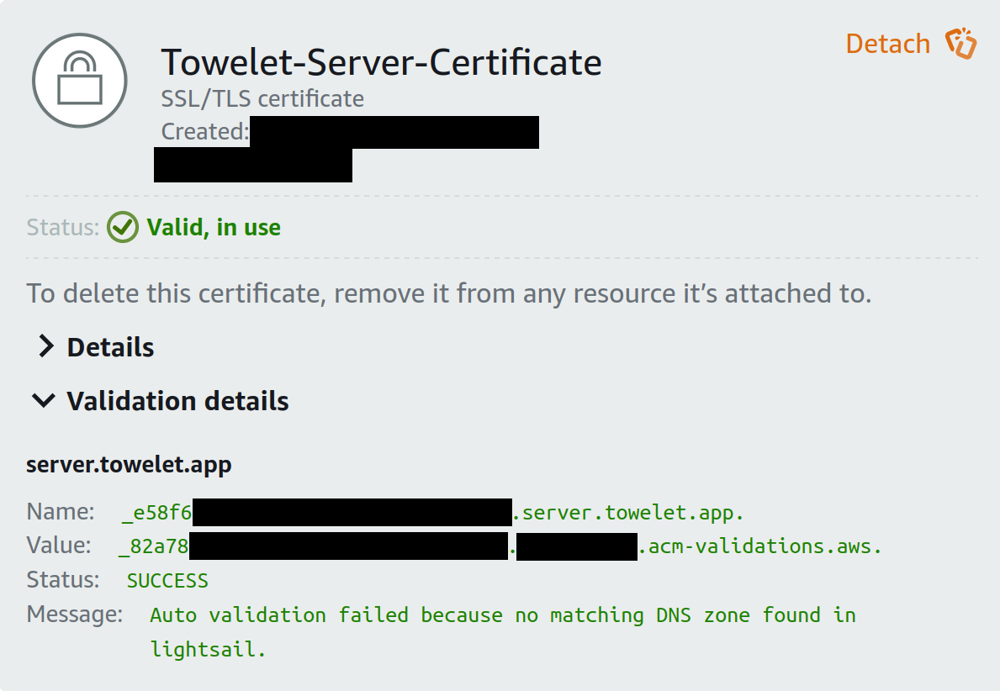
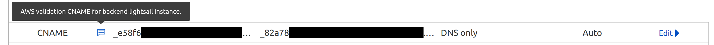

# Introduction

This document serves to detail the steps taken to configure the app's web communications correctly in a production environment.


- [Introduction](#introduction)
- [Domain and Routing](#domain-and-routing)
- [Configuring HTTP/HTTPS](#configuring-httphttps)
- [Frontend](#frontend)
  - [Restricting Public Access to S3 Bucket](#restricting-public-access-to-s3-bucket)
- [Backend](#backend)
  - [Enabling Private Domains for Lightsail](#enabling-private-domains-for-lightsail)

# Domain and Routing

We purchase a domain, [towelet.app](towelet.app), from the Cloudflare registrar. This domain will be registered within the Cloudflare DNS.

We add the following entries to our domain's lookup table:
- a CNAME record for the domain root, pointing to our S3 frontend;
- a CNAME record for the `server` subdomain, pointing to our Lightsail backend.


# Configuring HTTP/HTTPS

Traffic between end users and Cloudflare is served over HTTPS, and encrypted using Cloudflare's own shared SSL certificates.

Traffic between Cloudflare and the frontend has to be served over HTTP, as the S3 frontend's endpoint uses HTTP. Hence, all requests to the frontend should be served using the *Flexible* encryption scheme.

Traffic between Cloudflare and the backend has to be served over HTTPS, as Lightsail's endpoint uses HTTPS. Hence, all requests to the backend should be served using the *Full* encryption scheme.

These can be set up in the Cloudflare dashboard, under Rules -> Configuration Rules, specifying the requests' destination hostnames.

# Frontend

## Restricting Public Access to S3 Bucket

We need to configure our S3 frontend bucket's policy to restrict direct access via the HTTP endpoint. This is because direct user access via HTTP is insecure and prone to MITM attacks. Hence, users should only access the website via Cloudflare's HTTPS domain endpoint, and direct communication with our S3's HTTP endpoint should be relegated to the Cloudflare DNS.

This is done under the S3 console menu -> Permissions -> Bucket Policy:
```
{
    "Version": "2012-10-17",
    "Statement": [
        {
            "Sid": "PublicReadGetObject",
            "Effect": "Allow",
            "Principal": "*",
            "Action": "s3:GetObject",
            "Resource": "arn:aws:s3:::towelet.app/*",
            "Condition": {
                "IpAddress": {
                    "aws:SourceIp": [
                        // Cloudflare's IP address list here
                    ]
                }
            }
        }
    ]
}
```

This was taken from [Cloudflare's official guide](https://developers.cloudflare.com/support/third-party-software/others/configuring-an-amazon-web-services-static-site-to-use-cloudflare/). I guess this is secure enough?

# Backend 

## Enabling Private Domains for Lightsail

For Cloudflare to communicate with Lightsail over HTTPS, we need to create and install an SSL certificate on our Lightsail instance.

We generate an SSL certificate in the AWS Lightsail dashboard, specifying our backend's subdomain as the origin domain.



This generates a `key:value` pair in the form
```
key: _RNG.domain
value: _RNG2.RNG3.acm-validations.aws
```
which we will have to add as `name:target` to Cloudflare's domain lookup table, in order to verify that we own the domain we specified. (Remove the dots at the end of both strings.)



Once verification is complete, we will be able to access our Lightsail deployment using our domain.