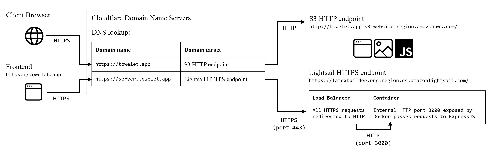
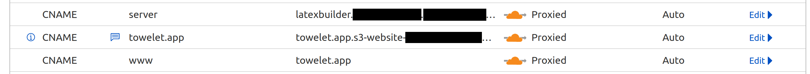

# Introduction

This document serves to be a primer on DNS, Routing and Web protocol concepts. It also details the steps taken to configure the app's web communications correctly in a production environment.

- [Introduction](#introduction)
- [Networking Primer](#networking-primer)
  - [Domains](#domains)
  - [Domain Name Servers (DNS)](#domain-name-servers-dns)
  - [Network Protocols](#network-protocols)
  - [HTTPS and SSL/TLS](#https-and-ssltls)
  - [SSL certificates](#ssl-certificates)
- [Cloudflare](#cloudflare)
  - [Domain and Routing](#domain-and-routing)
  - [Configuring HTTP/HTTPS](#configuring-httphttps)

# Networking Primer 

## Domains

A **domain** refers to a name given to a website, or web resource, that allows end users and other applications to access it using a *Uniform Resource Locator (URL)*.

These resources are usually hosted on servers that are connected to the Internet using specific IP addresses. Domains are essentially "mapped" to IP addresses, allowing end users to communicate with these IP addresses more easily.

When a domain is in use, it has to be registered with a domain **registrar**, which will keep a record of the domain (as well as its owner) in its DNS records.

## Domain Name Servers (DNS)

DNS, or **Domain Name Servers**, are servers containing tables that map **Fully Qualified Domain Names (FQDNs)** to their corresponding targets. These are known as **lookup tables**. 

Whenever a DNS receives a network request to a specific domain, the server will perform a **DNS lookup** to search for the corresponding domain target, then re-route this request to the correct target.

Targets may come in a few forms:
- **A records** and **AAAA records** point to IPv4 and IPv6 addresses respectively;
- **CNAME records**, or alias records, point to other FQDNs;
- **MX entries** direct email to a mail server, and dictate how emails shoud be handled using the Simple Mail Transfer Protocol (SMTP).

## Network Protocols

The **HyperText Transfer Protocol (HTTP)** is a network protocol that has been widely in use since antiquity, and is a method of information transfer. However, information transferred using this protocol is not encrypted

**HyperText Transfer Protocol Secure (HTTPS)** is a more recent *scheme* of the HTTP protocol, that encrypts data end-to-end, so that only the sender and receiver can read the data. It also prevents MITM attacks and domain spoofing by verifying data integrity.

HTTP has different *versions* of the protocol, such as HTTP/1, HTTP/1.1 and HTTP/2, the latter of which is the most widely used. HTTP/2 is optimised for greater data thoroughput, compression and caching.

Other data transfer protocols also exist, such as the **File Transfer Protocol (FTP)**.

## HTTPS and SSL/TLS

HTTPS uses asymmetric RSA encryption (involving a public and private key) in a procedure known as a TLS (transport layer socket) handshake.
- The server's public key is stored in its SSL (secure socket layer) certificate.
- The server's private key is kept secret.

Briefly, the handshake procedure can be described as follows:
1. The client and server greet each other. During this time, the server sends its SSL certificate to the client.
2. The client verifies the server's SSL certificate with its issuing authority.
3. The client encrypts a string of bytes, known as the *premaster*, with the server's public key.
4. The server decrypts the *premaster* using its secret key, and sends the plaintext back to the client.
5. Once the client has verified the plaintext, both client and server generate session keys, and communication continues using these keys.

Note that more modern versions of TLS, such as TLS 1.3, use alternative, shorter handshake methods that are more cryptographically secure than RSA.

## SSL certificates

Website and domain owners need to obtain an SSL certificate in order to encrypt their traffic with TLS, and serve their content over HTTPS. These certificates are usually issued by certificate authorities.

Technically, SSL certificates can be self-signed. However, most browsers do not consider self-signed certificates to be trustworthy.

# Cloudflare

## Domain and Routing

We purchase a domain, [towelet.app](towelet.app), from the Cloudflare registrar. This domain will be registered within the Cloudflare DNS.

We add the following entries to our domain's lookup table:
- a CNAME record for the domain root, pointing to our S3 frontend;
- a CNAME record for the `server` subdomain, pointing to our Lightsail backend.

## Configuring HTTP/HTTPS

Traffic between end users and Cloudflare is served over HTTPS, and encrypted using Cloudflare's own shared SSL certificates.

Traffic between Cloudflare and the frontend has to be served over HTTP, as the S3 frontend's endpoint uses HTTP. Hence, all requests to the frontend should be served using the *Flexible* encryption scheme.

Traffic between Cloudflare and the backend has to be served over HTTPS, as Lightsail's endpoint uses HTTPS. Hence, all requests to the backend should be served using the *Full* encryption scheme.

These can be set up in the Cloudflare dashboard, under Rules -> Configuration Rules, specifying the requests' destination hostnames.