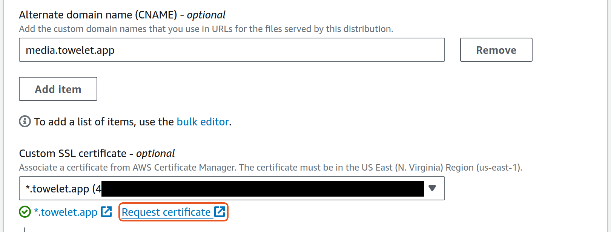
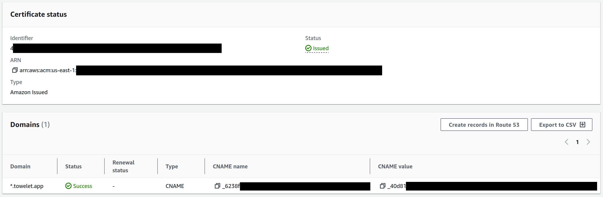
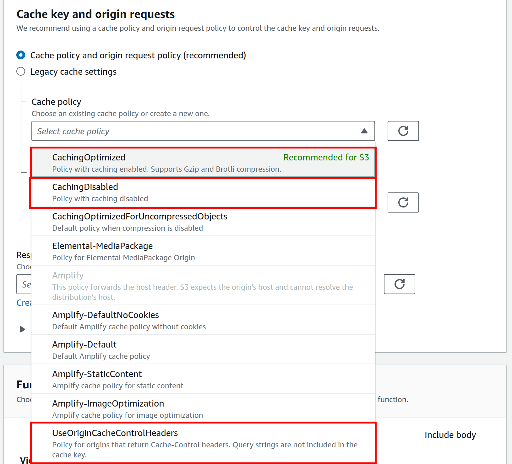

# Introduction

This document details how we implement image hosting using an S3 bucket with Cloudfront distribution.

- [Introduction](#introduction)
- [Configuring S3](#configuring-s3)
  - [Creating the S3 Bucket](#creating-the-s3-bucket)
  - [IAM User for Programmatic Upload](#iam-user-for-programmatic-upload)
- [AWS Javascript SDK: S3 Client](#aws-javascript-sdk-s3-client)
  - [Initialising the client](#initialising-the-client)
  - [Issuing commands](#issuing-commands)
- [Cloudfront with Custom Domain](#cloudfront-with-custom-domain)
  - [Custom SSL Certificate using Amazon Certificate Manager](#custom-ssl-certificate-using-amazon-certificate-manager)
- [S3 Network Security](#s3-network-security)
  - [Bucket Policy](#bucket-policy)
  - [CORS](#cors)
- [Cache Configuration](#cache-configuration)
  - [Browser Caching](#browser-caching)
  - [Cloudfront (Shared) Caching](#cloudfront-shared-caching)
  - [Solution](#solution)

# Configuring S3

## Creating the S3 Bucket

We set up an S3 bucket, **latexbuilderqns**, that will eventually store all the preview images of each of our questions in the database.

"Block public access" should be turned off.

## IAM User for Programmatic Upload

We create an IAM policy, **S3-upload-qn-images-to-latex-builder**, with _read and write_ permissions to our S3 bucket, then assign it to the **latexbuilderqns** bucket resource.

We then create an IAM user, **s3-latex-builder-upload**, and assign it the above permission policy.

We generate an access key pair for this user in the IAM console. This will be used to authenticate our IAM user so that it may upload images programmatically.

# AWS Javascript SDK: S3 Client

[AWS S3 SDK(JS) Reference](https://docs.aws.amazon.com/AWSJavaScriptSDK/v3/latest/client/s3/)

[NPM repo for @aws-sdk/client-s3](https://www.npmjs.com/package/@aws-sdk/client-s3)

Installation: `npm install @aws-sdk/client-s3`.

## Initialising the client

Our access keys and bucket name are stored in the following environment variables:
```
AWS_S3_ACCESS_KEY_ID
AWS_S3_SECRET_ACCESS_KEY
AWS_S3_BUCKET
```

To initialise the client:
```js
const { S3Client } = require("@aws-sdk/client-s3")
const client = new S3Client({ 
    region: "ap-southeast-1",
    credentials: {
        accessKeyId: process.env.AWS_S3_ACCESS_KEY_ID,
        secretAccessKey: process.env.AWS_S3_SECRET_ACCESS_KEY
    }
})
```

## Issuing commands

All commands have to be executed through the client.
- We first import the commands that we want to issue from the client.
- Each `Command` is an object which we must instantiate, with the required parameters.
- We then execute the `Command` using `await client.send(Command)`, whatever the execution command is.

Example:
```js
    const params = {
        "Body": image, // contains byte data of image file
        "Bucket": previewBucket,
        "Key": imageName, // file will be named this in the bucket
        "ContentType": "image/png"
    }
    const data = await client.send(new PutObjectCommand(params))
```

# Cloudfront with Custom Domain

We will serve our images through Cloudfront to reduce the volume of data transfer that S3 has to handle.

To do so, we first create a new Cloudfront distribution. This distribution will usually have the URL format `https://[gibberish].cloudfront.net`.

We add our S3 bucket as the origin. (Note that Amazon will automatically create an _Origin Access Control_ (OAC) for us. This may be viewed in the Security -> Origin Access section of the Cloudfront console.)

## Custom SSL Certificate using Amazon Certificate Manager

We will then route all traffic to this distribution through our domain, `files.towelet.app`. An SSL certificate associated with our domain is required for us to be able to do so.



Because Cloudflare uses their own suite of universal SSL certificates (and requires us to pay for private ones), we must request for our own private certificate through ACM. Similar to custom domain validation for Lightsail, this generates a key:value pair in the form
```
key: _RNG.domain
value: _RNG2.RNG3.acm-validations.aws
```
which we will have to add as `name:target` to Cloudflare's domain lookup table.



Once domain verification has succeeded, our cloudfront distribution is now accessible through our domain.

**Note:** This certificate is associated with the **us-east-1** region.

# S3 Network Security

## Bucket Policy

Because our default bucket endpoint is insecure, we should now only allow access to our bucket through the Cloudfront distribution. This means that only our Cloudfront service should be allowed to perform GetObject operations:
```json
{
    "Sid": "AllowCloudFrontServicePrincipal",
    "Effect": "Allow",
    "Principal": {
        "Service": "cloudfront.amazonaws.com"
    },
    "Action": "s3:GetObject",
    "Resource": "arn:aws:s3:::latexbuilderqns/*",
    "Condition": {
        "StringEquals": {
            "AWS:SourceArn": "arn:aws:cloudfront::[distribution ID]
        }
    }
}
```

[Origin Access Control guide](https://docs.aws.amazon.com/AmazonCloudFront/latest/DeveloperGuide/private-content-restricting-access-to-s3.html)

## CORS

We should only allow resource sharing with requests originating from our website. Thus, we set the following CORS policy:

```json
"AllowedHeaders": [
    "Authorization", "Content-Range", "Accept", "Content-Type", 
    "Origin", "Range"
],
"AllowedMethods": ["GET"],
"AllowedOrigins": ["files.towelet.app"]
```

[S3 Cors Guide](https://docs.aws.amazon.com/AmazonS3/latest/userguide/ManageCorsUsing.html)

# Cache Configuration

Annoyingly, both our browser and CloudFront optimise their network resource usage by caching media. This is not ideal for us, because our application needs to be able to display the latest image at all times to end users! Our goal is to
- cache images as much as possible, while still
- ensuring that, after every update to a question, the new image is definitively served over any older versions to our end users.

## Browser Caching

Browsers cache resources so that repeated requests for the same resource do not lead to unnecessary network traffic. Each individual request corresponds to one cached resource.

In particular, this means that
- POST requests, which are intended for requests with a side effect on the server, are usually not intended to be cache-able. (They were not cache-able until some time ago; more information can be found [here](https://www.mnot.net/blog/2012/09/24/caching_POST), and I think it gets quite complex.)
- GET requests are cached in a URL-sensitive way. Parameters in a query string result in a different URL and hence a different resource as far as caches are concerned. [Explanation](https://stackoverflow.com/questions/2744975/how-do-i-deal-with-different-requests-that-map-to-the-same-response)

The caching behaviour of a resource can be controlled by issuing the `Cache-Control` header with the request for the resource. When the server has responded with the resource and it is stored in the cache, the cache will keep the resource fresh for as long as the `Cache-Control` header specifies. Once the resource expires, the cache will then re-fetch the resource from the origin.

[HTTP Caching Documentation](https://developer.mozilla.org/en-US/docs/Web/HTTP/Caching#overview)

[Caching Tutorial](https://www.mnot.net/cache_docs/#TIPS)

## Cloudfront (Shared) Caching

Cloudfront enhances content delivery by periodically caching the contents of our site on its edge servers. These are geographically distributed and so reduce the round-trip time required to deliver said content to end users geographically further away from our origin server.

There are three main options available to us:
- Optimised caching: Cloudfront caches everything by default I guess.
- Caching disabled: No caching
- Use Origin Cache Control Headers: Cloudfront adheres to the expiry time/age specified in the `Cache-Control` header of our origin request.



## Solution

We affix a timestamp to every image URL as a request parameter, representing the `lastModified` time of that question. This way, the image displayed changes if and only if the `lastModified` value of a question changes:

```
https://files.towelet.app/1.png?1719381234567
```

Turns out our solution bypasses Cloudfront's caching mechanism nicely as well.
